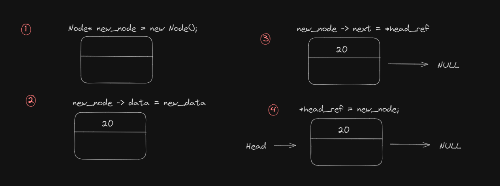
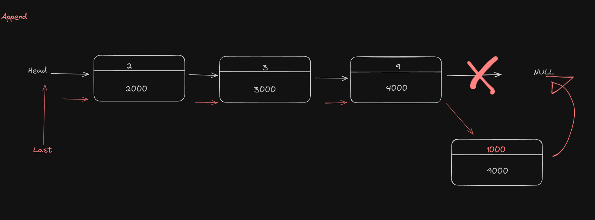

# Data Structure

### linked list 


##### Basic linked list
create node สร้าง node เพื่อเก็บข้อมูลและpointerไว้เพื่อเรียกใช้งาน
```c++
struct Node
{
    int data;
    Node *next;
}
```
#### PUSH
push method มีไว้เพื่อส่งค่าเข้าไปเก็บใน list
```c++
void push(Node** head_ref,int new_data)
{
    Node* new_node  = new Node(); //สร้าง node ใหม่ขึ้นมาเพื่อเก็บค่าตัวที่ต้องการรับค่า
    new_node -> data = new_data;  // โยนค่าลงไปในNodeใหม่
    new_node -> next = *head_ref; //ลิ้ง node ใหม่เข้ากับ node ก่อนหน้า
    *head_ref = new_node; // set head ให้เป็น nodeใหม่
}
```



<br />
<br />
<br />
<br />
<br />
<br />

#### วิธีใช้งาน

```c++ 
int main()
{
    Node *head = NULL;
    push(&head, 1);
    push(&head, 2);
    push(&head, 3);
    while (head != NULL)
    {
        cout << head->data << " ";
        head = head->next;
    }
}
```
#### `output : 3 2 1`
____
### Insert After
Insert after method จะระบุค่าหลังจากnodeที่ต้องการเช่น เรามีค่า 1 4 5 9 เราอยากใส่ค่า 3 ลงไประหว่าง 1 และ 4 ก็ใช้งานInsert afterได้ เป็น 1 3 4 5 9

<!-- 
``` -->

```c++ 
void insertAfter(Node *prev_node, int data)
{
    Node *new_node = new Node();
    if (prev_node == NULL) // เช็คว่า Node ก่อนหน้ามีค่าให้ link หรือไม่
    {
        cout << "Previous node must not NULL";
    }
    new_node->data = data;
    new_node->next = prev_node->next; //โยงไปยัง Node ถัดไปของตัวก่อนหน้า
    prev_node->next = new_node;
}
```


#### วิธีใช้งาน

```c++
int main()
{
    Node *head = NULL;
    push(&head, 1);
    push(&head, 2);
    push(&head, 9);
    push(&head, 3);
    insertAfter(head->next, 5); // ใส่ค่า 5 ลงไปหลังจากnode 2
    while (head != NULL)
    {
        cout << head->data << " ";
        head = head->next;
    }
}
```
#### `output : 3 9 5 2 1`
___

### Append
Append ใช้สำหรับใส่ค่าเข้าไปตัวสุดท้ายของ list
<!-- 
``` -->
```c++ 
void append(Node **head_ref, int data)
{
    Node *new_node = new Node();
    Node *last = *head_ref; //
    new_node->data = data;
    new_node->next = NULL;
    if (*head_ref == NULL)
    {
        *head_ref = new_node;
        return; 
    }
    while (last->next != NULL) 
    {
        last = last->next;
    }
    last->next=new_node;
    return;
}
```


#### วิธีใช้งาน
```c++

int main()
{
    Node *head = NULL;
    push(&head, 1);
    push(&head, 2);
    push(&head, 9);
    push(&head, 3);
    append(&head, 100);
    while (head != NULL)
    {
        cout << head->data << " ";
        head = head->next;
    }
}
```
#### `output : 3 9 2 1 100`
___